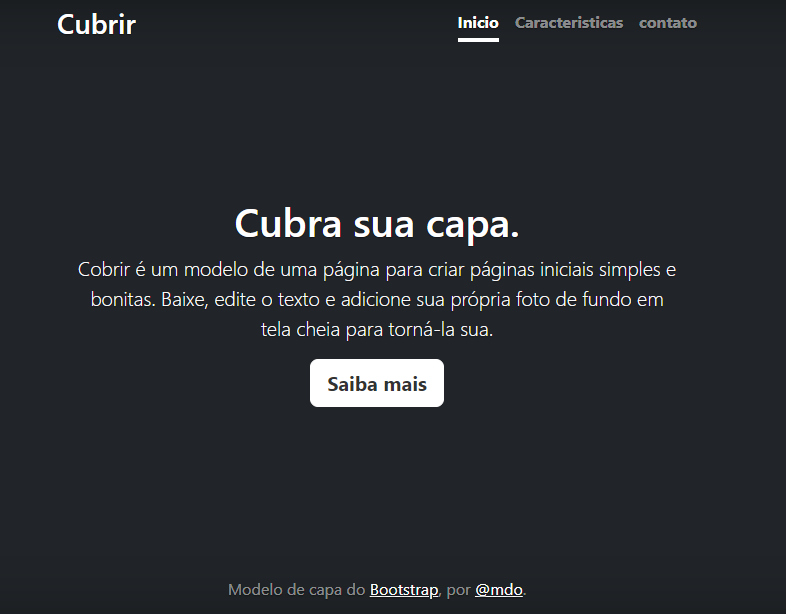

# 📂Indice

[projeto - portifolio para escrita do README](#projeto---portifolio-para-escrita-do-readme)  
[Descrição](#descri%C3%A7%C3%A3o)  
[funcionalidades](#funcionalidades)  
[Tecnologias ultilizadas](#tecnologias-ultilizadas)  
[fontes consultadas](#fontes-consultadas)  
[autores](#autores) 

---

# projeto - portifolio para escrita do README

## Descrição
Fiz esse site com intuito de aprender a ultilizar o bootstrap

## funcionalidades:

* Inicialmente te a tela inicial que posui um texto, um botão, e alternativas para sair da pagina inicial que são: Caracteristicas e
contato

* A funcionalidade do site não foi indentificada ainda, pois eu usei esse site para aprender mais sobre [bootstrap](https://www.alura.com.br/artigos/bootstrap)

### Tecnologias ultilizadas

* Git Hub
* HTML
* CSS
* VScode
* Bootstrap

## fontes consultadas:

### Sites:

[**Git do lohhans**](https://gist.github.com/lohhans/f8da0b147550df3f96914d3797e9fb89)  

[**Como escrever um README do Alura**](https://www.alura.com.br/artigos/escrever-bom-readme)

## autores

Professor *Leonardo*  

[**conta do git**](https://github.com/LeonardoRochaMarista)  

Aluno: *Gustavo*

[**conta do git**](https://github.com/foxymplayer)
